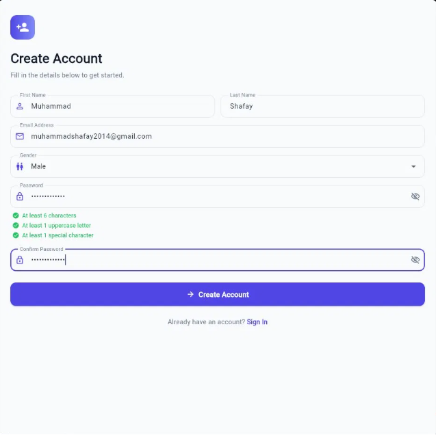
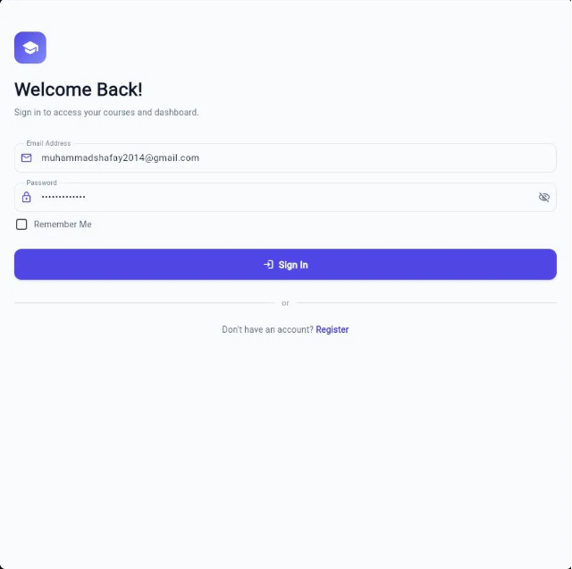
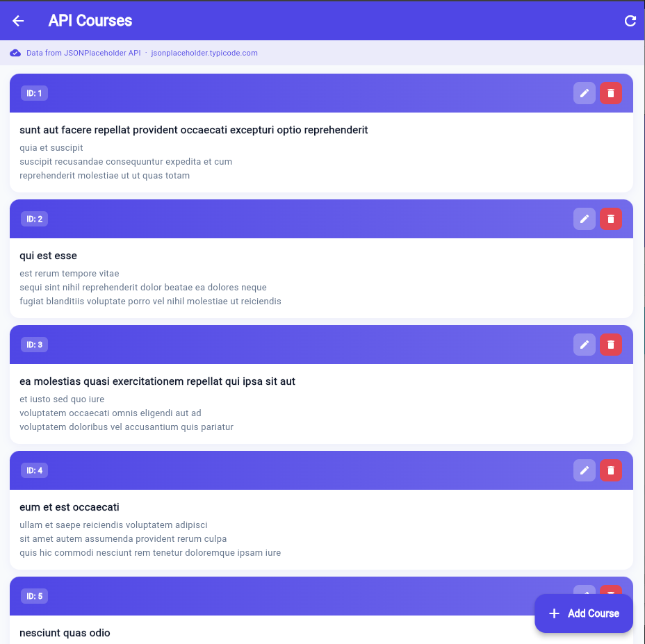

# EduAuth — Flutter Multi-Screen Authentication App

A complete multi-screen Flutter application built for the **Mobile App Development** assignment.  
It demonstrates user authentication, form validation, REST API CRUD, offline-first caching, and clean architecture.

---

## Student Information

| Field | Value |
|-------|-------|
| **Student Name** | *Anas Mirza* |
| **Student ID** | *SE221030* |
| **Course** | Mobile App Development |
| **Framework** | Flutter / Dart |
| **API** | JSONPlaceholder (`https://jsonplaceholder.typicode.com`) |
| **API Docs** | https://jsonplaceholder.typicode.com/guide |

---

## Tools & Packages Used

| Package | Purpose |
|---------|---------|
| `provider` | State management (`ChangeNotifier` + `Consumer`) |
| `shared_preferences` | Auth session persistence |
| `http` | REST API calls to JSONPlaceholder |
| `hive` / `hive_flutter` | Local NoSQL cache for course data |
| `connectivity_plus` | Detect online/offline to route repository logic |
| `path_provider` | Hive storage paths (transitive dependency) |

---

## Architecture

```
UI (Screens)
    ↓
State Management (CourseController / AuthController via Provider)
    ↓
Repository (CourseRepository)
    ↓                           ↓
API Service (CourseApiService)   Local Database (CourseLocalStorage / Hive)
```

| Layer | File(s) | Responsibility |
|-------|---------|----------------|
| **UI** | `screens/courses/*`, `screens/dashboard/*` | Render widgets, handle user input |
| **State** | `controllers/course_controller.dart` | Loading / success / error / empty states, optimistic UI |
| **Repository** | `repositories/course_repository.dart` | Decide API vs cache, sync data |
| **API** | `services/course_api_service.dart` | HTTP only — no business logic |
| **Local DB** | `data/local/course_local_storage.dart` | Persist courses in Hive |
| **Connectivity** | `core/services/connectivity_service.dart` | Network status checks |

---

## Offline & State Management Approach

### When the API is called

The JSONPlaceholder API is **only** called when you open **API Courses** (or refresh that screen). Login and registration do not fetch courses.

| Action | What happens |
|--------|----------------|
| Open API Courses (online) | HTTP GET → save to Hive → show live data |
| Pull-to-refresh / refresh button | Same as above |
| Open API Courses (offline, cache exists) | Load from Hive only — no API call |
| Open API Courses (offline, no cache) | Error: no cached data yet |
| API fails but cache exists | Show last saved Hive data |

### Offline-first flow

1. **Online fetch:** Call JSONPlaceholder → save result to Hive → show live data.
2. **Offline fetch:** Load courses from Hive cache → show offline banner.
3. **API failure with cache:** Fall back to last saved Hive data instead of an empty error screen.
4. **Mutations:** Create/update/delete write to Hive immediately; remote calls run when online.

### What persists after closing the app

| Data | Persists? | Notes |
|------|-----------|-------|
| Hive course cache | Yes | Saved on disk; survives app restarts until app data is cleared |
| In-memory UI state (`CourseController`) | No | Reset when the app process is killed |
| Auth session (`shared_preferences`) | Yes | Remember Me / restored login |

`connectivity_plus` checks whether a network interface is available, not whether the internet is fully reachable. If Wi‑Fi is still connected but the internet is down, the app may still attempt the API first; on failure it falls back to Hive when cached data exists.

### State management

- `CourseController` exposes `ApiState` (`initial`, `loading`, `success`, `error`, `empty`).
- UI uses `Consumer<CourseController>` — no direct API or Hive access from widgets.
- Flags `isOffline` and `isFromCache` drive the status banner on the courses screen.

### Optimistic updates

- **Update:** UI updates instantly; if the remote PUT fails while online, the previous course is restored and Hive is rolled back.
- **Delete:** Item is removed instantly; if the remote DELETE fails while online, the item is re-inserted and Hive is restored.

### UX enhancements

- Pull-to-refresh on the course list
- Search/filter by title, description, or ID
- Dedicated empty-state UI
- Linear progress indicator during background refresh
- Offline / cache status banner

---

## Project Structure

```
lib/
├── main.dart
├── core/
│   ├── constants/app_constants.dart
│   ├── enums/
│   │   ├── api_state_enum.dart
│   │   ├── auth_state_enum.dart
│   │   └── gender_enum.dart
│   ├── services/connectivity_service.dart
│   └── validators/app_validator.dart
├── controllers/
│   ├── auth_controller.dart
│   └── course_controller.dart
├── data/
│   └── local/course_local_storage.dart
├── models/
│   ├── course_model.dart
│   ├── subject_model.dart
│   └── user_model.dart
├── repositories/
│   └── course_repository.dart
├── services/
│   └── course_api_service.dart
├── screens/
│   ├── courses/
│   ├── dashboard/
│   ├── detail/
│   ├── login/
│   └── registration/
└── widgets/
```

| Operation | Method | Endpoint |
|-----------|--------|----------|
| Fetch all courses | `GET` | `/posts?_limit=20` |
| Fetch single course | `GET` | `/posts/:id` |
| Create course | `POST` | `/posts` |
| Update course | `PUT` | `/posts/:id` |
| Delete course | `DELETE` | `/posts/:id` |

### Prerequisites

- Flutter SDK ≥ 3.0.0
- Dart ≥ 3.0.0

### Architecture
- **`CourseApiService`** — pure Dart HTTP layer, zero Flutter imports. Handles all network calls, JSON encoding/decoding, and error throwing.
- **`CourseController`** — ChangeNotifier controller that calls the service, manages `ApiState` (loading / success / error), and exposes the course list to the UI.
- **`CoursesScreen` / `CourseFormScreen`** — UI only reads state and calls controller methods. No HTTP logic anywhere in the UI layer.

```bash
git clone <your-repo-url>
cd myapp
flutter pub get
flutter run
```

---

## Screenshots

| Splash | Registration | Login |
|--------|-------------|-------|
|  |  |  |

| Dashboard | Detail | API Courses |
|-----------|--------|-------------|
|  |  |  |

---

## Features

### Authentication Flow
- Registration → Login → Dashboard → Detail
- Session persistence via `shared_preferences`
- Automatic session restoration on launch

### API Courses (CRUD + Offline)
- List, create, edit, and delete courses via JSONPlaceholder
- Hive cache for offline access
- Optimistic update/delete with rollback on failure
- Search and pull-to-refresh

---

## License

This project is submitted for academic evaluation only.
